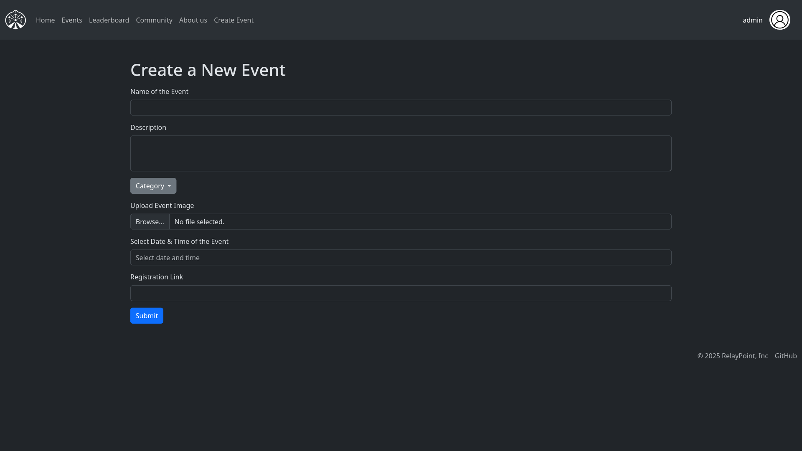
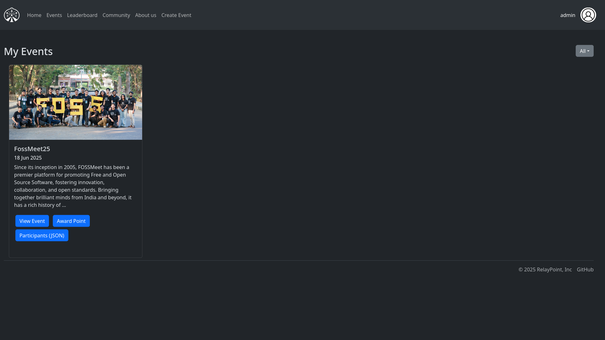

# RelayPoint Organizer Documentation

## Overview
RelayPoint is an event management platform that allows organizers to create and manage events. This documentation will guide you through the process of creating and managing events on the platform.

## Access Control
- Only users with **Admin** or **Organizer** roles can create events
- Admins can grant organizer privileges to other users through the `/make_organizer` route
- Regular users cannot create events

## Creating Events
To create an event, follow these steps:

1. Navigate to the Create Event page
2. Fill in the required event details:
   - Event Name
   - Description
   - Category
   - Date and Time
   - Event Image
   - Registration Link (optional)

## Event Management
As an organizer, you can:
- Create new events
- View all events you've created
- Manage event registrations
- Award points to participants
- Track event attendance

## Making New Organizers
Admins can make other users organizers by:
1. Using the `/make_organizer` route
2. Providing the username of the user to be made an organizer

## Best Practices
1. Always provide clear event descriptions
2. Upload compressed event images. Large images can slow down the site. 
3. Set appropriate event categories
4. Include registration links when applicable
5. Award points promptly after events

## Support
For any questions or issues, please contact the platform administrators.
