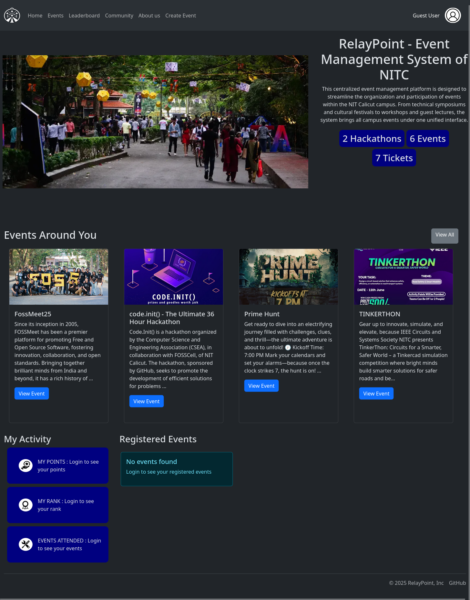
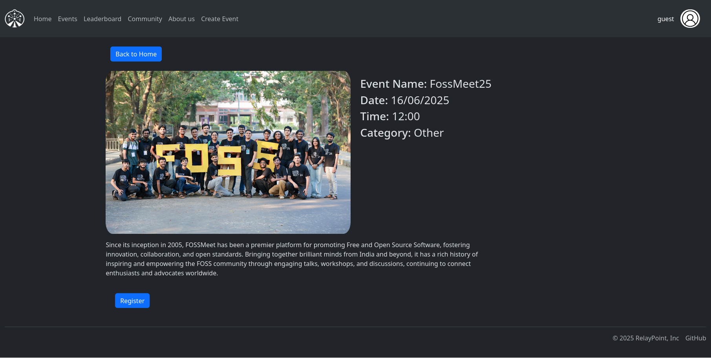

# RelayPoint - Event Management System

A comprehensive event management system built for NIT Calicut, designed to streamline event organization, registration, and participation tracking.

## Features

- User authentication and role-based access control
- Event creation and management
- Event registration with QR code generation
- Points system for event participation
- Leaderboard for tracking participant rankings
- Community blog section
- Workshop management
- Image upload and management
- Responsive web interface

## Screenshots

<div style="display: grid; grid-template-columns: 1fr 1fr; gap: 20px;">
    <div>
        <em>Homepage with upcoming events and user dashboard</em>
        
    </div>
    <div>
        <em>Events listing page with filtering options</em>
        
    </div>
    <div>
        <em>Event registration with QR code generation</em>
        
    </div>
    <div>
        <em>Leaderboard showing participant rankings and points</em>
        
    </div>
</div>

## Prerequisites

- Python 3.x
- PostgreSQL database
- pip (Python package installer)

## Setup Instructions

1. Clone the repository:
   ```bash
   git clone <repository-url>
   cd RelayPoint
   ```

2. Create a `.env` file in the root directory with the following variables:
   ```
   DB_URL=your_postgresql_database_url
   HASH_KEY=your_hash_key
   ADMIN_USERNAME=your_admin_username
   ADMIN_PASSWORD=your_admin_password
   ```

3. Create and activate a virtual environment:
   ```bash
   python -m venv venv
   source venv/bin/activate  # On Windows: .\venv\Scripts\activate
   ```

4. Install required packages:
   ```bash
   pip install -r requirements.txt
   ```

5. Initialize the database:
   ```bash
   python pgapp.py
   ```
   This will create the necessary database tables and an admin user.

6. Run the application:
   ```bash
   python app.py
   ```
   The application will be available at `http://localhost:5000`

## User Roles

- Admin: Full system access
- Organizer: Can create and manage events
- Student: Can register for events and participate
- FOSSCell Member: Special access to certain features

## Database Schema

The system uses the following main tables:
- Users: User authentication and role management
- UserStats: User participation and points tracking
- Events: Event details and registration
- Images: Image storage for events
- Posts: Community blog posts

## Contributing

1. Fork the repository
2. Create a feature branch
3. Commit your changes
4. Push to the branch
5. Create a Pull Request

## Contact

For support, contact: support@relaypoint.com

## License

This project is licensed under the MIT License - see the LICENSE file for details.

## Team

- **Ibinu Jaleel** - [LinkedIn](https://www.linkedin.com/in/ibinu-jaleel-163000323/)
- **Shalin Varghese** - [LinkedIn](https://www.linkedin.com/in/shalin-varghese-023a08323/)
- **Jiss Janex** - [LinkedIn](https://www.linkedin.com/in/jiss-janex-246711241/)
- **Richu Shine** - [LinkedIn](https://www.linkedin.com/in/richu-shine-b8a771330/)